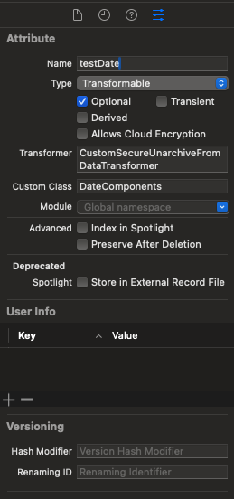
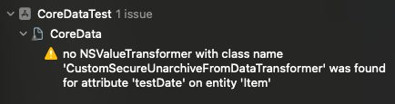

# Custom `NSSecureUnarchiveFromDataTransformer` Xcode 15 warning

This project shows an warning inside Xcode 15 related to custom "NSSecureUnarchiveFromDataTransformer"

When creating a custom `NSSecureUnarchiveFromDataTransformer` in order to handle entities of type `NSDateComponents`. It all works and I did not see any warnings in the "Issue navigator" inside Xcode but with Xcode 15 I started seeing this warning.

This is the custom transformer:
```
@objc(CustomSecureUnarchiveFromDataTransformer)
final class CustomSecureUnarchiveFromDataTransformer: NSSecureUnarchiveFromDataTransformer {
    
    override class var allowedTopLevelClasses: [AnyClass] {
        return [NSDateComponents.self]
    }
    
    static let name = NSValueTransformerName(rawValue: String(describing: CustomSecureUnarchiveFromDataTransformer.self))
    
    public static func register() {
        let transformer = CustomSecureUnarchiveFromDataTransformer()
        ValueTransformer.setValueTransformer(transformer, forName: name)
    }
}
```

which is set to the Core data entity's "Transformer":



which leads to the following warning in Xcode 15:


> /Users/..../CoreData:1:1 no NSValueTransformer with class name 'CustomSecureUnarchiveFromDataTransformer' was found for attribute 'testDate' on entity 'MyTestObject'

App works just fine and there are no problems, but this warning is shown.

Here is a simple test project.

# Steps to reproduce
- Open project "CoreDataTest.xcodeproj" inside Xcode 15
- Build project (Cmd+B) or run the app (Cmd+R)
- View the warning in the "Issue navigator"


